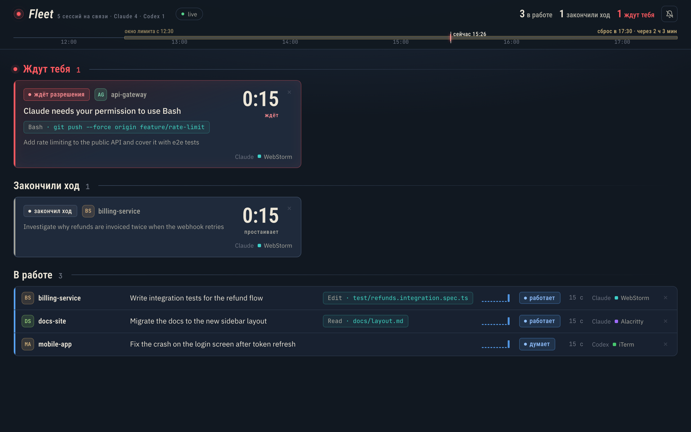

# claude-fleet

[](https://github.com/jackflaggg/claude-fleet/actions/workflows/ci.yml)

One local dashboard for every running Claude Code and Codex session: what each one is doing
and which one is waiting for you. Runs entirely on your Mac, sends nothing to the network.

The problem it solves is polling. With several agent sessions open you keep cycling through
terminal tabs asking "done yet?". Fleet shows all of them at once and nudges you the moment
one stops and needs a decision.



*Board UI labels are currently in Russian; an English locale is on the list.*

## How it works

```
Claude Code ─┐
             ├──(lifecycle hook)──> hooks/report.sh ──POST──> server.js ──SSE──> browser
Codex ───────┘

click on a card ──POST /focus──> server.js ──> webstorm <cwd>   (focuses the project window)
```

- **Hooks.** Claude Code (`~/.claude/settings.json`) and Codex (`~/.codex/hooks.json`) lifecycle
  hooks call `hooks/report.sh`, which forwards the event JSON to the local server. Hooks are
  passive: your normal workflow in the IDE does not change.
- **server.js** keeps all sessions in memory and streams the board over SSE. Plain `node:http`,
  zero npm dependencies, Node 22.
- **public/** is the client: semantic HTML, one stylesheet, ES modules split by layer.

## Card statuses

Derived from lifecycle events of both agents:

| Status | When | Colour |
|--------|------|--------|
| ready | session just started (`SessionStart`) | grey |
| thinking | you sent a prompt (`UserPromptSubmit`) | blue |
| working | a tool is running or just finished (`PreToolUse` / `PostToolUse`) | blue |
| compacting | history is being compacted (`PreCompact`) | blue |
| error | a tool returned an error (best effort) | orange |
| finished turn | `Stop`: idle, no prompt, not asking for anything | neutral |
| **needs you** | `Notification` / `PermissionRequest`, a question, an API failure | red |

Red cards are collected in a "waiting for you" section at the top. The longest-waiting one goes
first, with a large timer showing how long it has been sitting there. A red card shows not only
"waiting for permission" but what exactly: the notification text plus the tool and its target,
for example `Bash · git push --force origin master`, so the decision can be made from the board.

Sessions that finished their turn get a neutral section of their own: you see who is idle and
for how long, but they never count toward the badge or notifications. Red means "you are needed".

## What's on the board

- **Rail** under the header: one six-hour timeline with session start ticks in project colour,
  red ticks for "entered waiting", a brass bar for the current usage window with its reset time,
  and a "now" marker.
- **Waiting for you**: red cards with the reason, the tool being asked about, the last task and
  a big wait timer.
- **Finished turn**: same cards without red, showing idle time.
- **Working**: dense rows in one table: project monogram, task, current tool, a 10-minute
  activity sparkline, status, age, agent and terminal.

Fonts ship with the repo, the board never fetches anything from the internet.

## Closed sessions disappear on their own

A closed session leaves the board in 10-20 seconds, for both Claude Code and Codex. The agent
process PID arrives with each hook event and is checked with `kill(pid, 0)` only while the
board is open, no disk polling, no background utilities. Removal requires two consecutive
misses so a brief reconnect never drops a live card. For edge cases (a cached card without PID,
a hung but alive process) there is a × button on hover; without a PID the fallback cleanup
runs after 6 hours.

## Run

```bash
node server.js
# claude-fleet listens on http://localhost:4319
```

Default port is `4319`, override with `FLEET_PORT`.

To install hooks globally and start the server at login:

```bash
./scripts/install.sh
```

The script creates `.env`, merges the hooks into `~/.claude/settings.json` and
`~/.codex/hooks.json` (foreign hooks are preserved, a backup is taken first) and installs a
launchd agent. It is idempotent. Codex will ask once to trust the new command hooks via
`/hooks`. Details and the manual path are in [install.md](./install.md), removal is
`./scripts/uninstall.sh`.

`./scripts/board.sh` opens the board as a standalone app window (no tabs, no address bar) that
lives on a second monitor and shows the red counter badge on its dock icon.

## Localhost only, and `Host` is verified

The server binds to `127.0.0.1` and additionally validates the `Host` header. Without that
check a page in your browser could use DNS rebinding to pose as localhost and read `/stream`,
which carries your prompts, project paths and shell commands. Mutating requests from a foreign
origin are rejected by `Sec-Fetch-Site` / `Origin`. To view the board from another device add
its host to `FLEET_ALLOWED_HOSTS` in `.env` and set `FLEET_TOKEN` (`openssl rand -hex 16`):
open `http://<host>:4319/?token=<value>` once on that device, the server sets an `HttpOnly`
cookie and redirects to `/`; without the cookie every non-loopback request gets 403. Loopback
(this machine, hooks, the channel process) is always trusted. An empty token keeps the old
behaviour: anyone on the LAN with an allowed `Host` can read the board.

## Usage window

The rail shows the current 5-hour limit window as a brass bar: "window since 14:30" and
"resets at 19:30 · in 2 h 05 min". The limit belongs to the account, not the project, so the
bar is one per board. It is computed from local transcripts in `~/.claude/projects` (read
only, nothing leaves the machine) and matches `/usage` in Claude Code to the minute.

## Silent by design, notifications opt-in

The board itself is the signal: the red section, the red card accent, the counter badge on the
favicon of a background tab. Nothing beeps. System notifications can be enabled with the bell
in the header for the case when the board is not visible (full-screen IDE). Even then they are
always silent, fire only for new waiting sessions, replace each other instead of stacking, and
click through to the session.

## Click on a card

Returns you to where the session actually lives, using the terminal bundle id sent by the hook:
a WebStorm terminal in a real project (has `.idea`) focuses the project window through the CLI
launcher (`webstorm <cwd>`); any other terminal (Alacritty, iTerm, Terminal) is simply brought to
front. JetBrains has no public API for focusing a specific terminal tab, so that last step is
yours.

## Answering from the board (prototype)

Behind `FLEET_CHANNEL=1` there is a prototype that lets you allow or deny a permission request
and send a reply to a Claude Code session directly from the card. It runs as a stdio MCP server
that Claude Code starts per session (channel research preview) and talks to the board over SSE.
See [install.md](./install.md), "Answering from the board". Without the flag the board is
read-only.

## Tests

```bash
node --test
npm run verify:liveness
```

The first command covers the pure cores: statuses, focus resolution, request guards, usage
window, PID liveness and board formatters. The second runs a million PID checks and a million
open/close cycles, forces GC and asserts CPU budgets, heap/RSS plateau and an empty internal
`Map` afterwards.

## Footprint

Measured under load: 60 MB at start, ~70 MB in real use, then a plateau. 40,000 events and
300 board reconnects add no growth. Under a synthetic storm of 12,000 events/s the heap
peaks at about 105 MB and stays there.

Each hook call costs ~13 ms: it forks nothing except `curl` itself and fails instantly when the
server is down. Codex uses the same event path through the official
[Codex lifecycle hooks](https://learn.chatgpt.com/docs/hooks), so Fleet never polls
`~/.codex/sessions`. With the board open, PIDs are checked every 10 s at roughly 200 ns each.

`http://localhost:4319/stats` returns diagnostics: uptime, memory, session and board counts,
event sizes by type.

## Configuration (`.env`)

| Variable | Default | Meaning |
|----------|---------|---------|
| `FLEET_PORT` | `4319` | server port, also read by `report.sh` |
| `FLEET_HOST` | `127.0.0.1` | bind address |
| `FLEET_ALLOWED_HOSTS` | empty | extra `Host` values, comma-separated |
| `FLEET_TOKEN` | empty | trust token for non-loopback clients via `/?token=` cookie; empty = off |
| `FLEET_STALE_HOURS` | `6` | idle threshold for fallback cleanup |
| `FLEET_BLANK_MINUTES` | `15` | threshold for a card with no task and no tool |
| `FLEET_TRANSCRIPTS` | `~/.claude/projects` | transcripts folder for the usage window |
| `FLEET_USAGE_HOURS` | `5` | length of the limit window |
| `FLEET_WEBSTORM` | `/usr/local/bin/webstorm` | path to the WebStorm CLI launcher |
| `FLEET_AUTOOPEN` | `1` | open the board at login (read by `install.sh`) |
| `FLEET_CHANNEL` | `0` | enable the answer-from-board prototype |

## Known limitations (v1, on purpose)

- No history of finished sessions, the board shows live ones only.
- No jump to a specific terminal tab inside a project (JetBrains limitation).
- Only Claude Code and Codex are tracked.
- Board UI is in Russian for now.

Russian version of this document: [README.ru.md](./README.ru.md).

## License

[MIT](LICENSE). Copyright (c) 2026 Rasul Khamzin.
